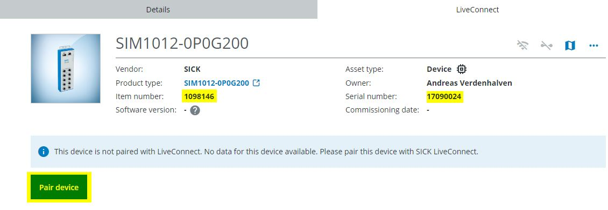
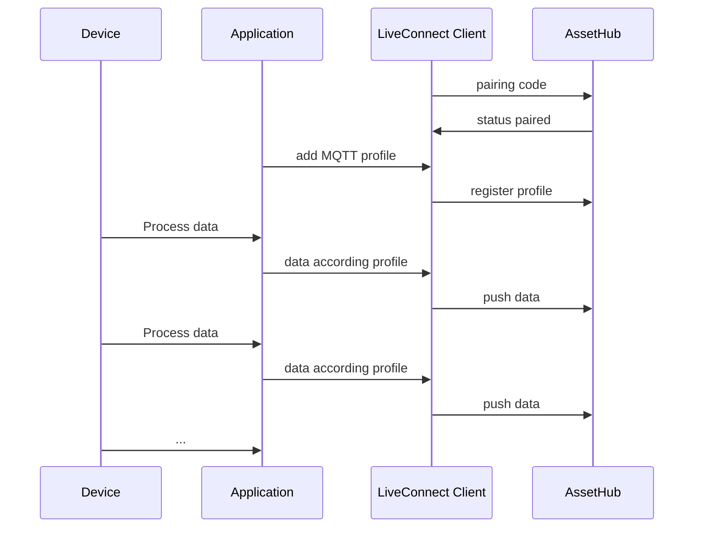
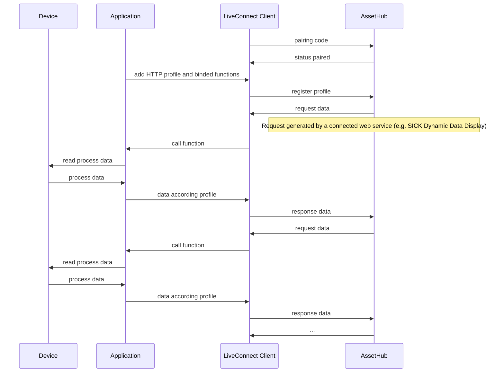
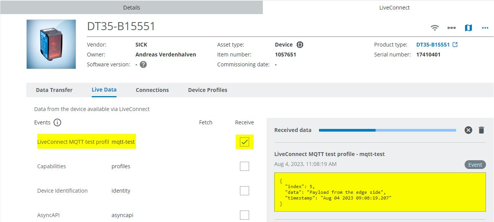
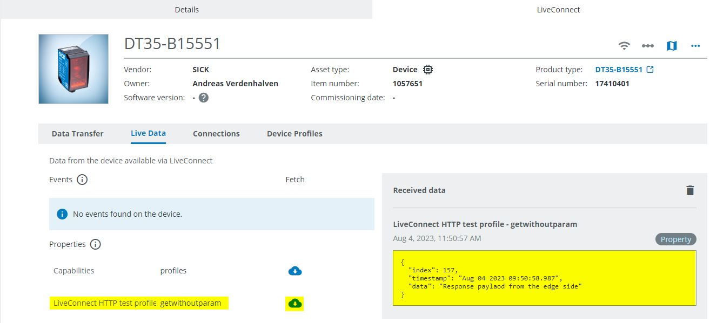

# CSK_Module_LiveConnect
This module provides the possibility to communicate data to a digital device (digital twin) configured in the SICK AssetHub.

## Pairing
Before data can be exchanged, the physical gateway device must first be paired with the digital twin in the SICK AssetHub. Please do the following step by step:

**SICK AssetHub**
 1. Open the digital service [SICK AssetHub](https://assethub.cloud.sick.com)
-- In order to use the SICK AssetHub, you need to subscribe it via the [SICK Digital Service Catalog](https://cloud.sick.com/subscription)
-- You also need a subscription for SICK LiveConnect
 2. Create a digital twin of your gateway device using the part-/ and serial number of the physical device.
 3. Start the pairing process to pair the digital twin with a physical device via SICK LiveConnect.

 4. Please copy the pairing code.

**SICK LiveConnect Client App**

 5. Open the UI of the SICK LiveConnect Client app by entering the IP address of your device in the browser.
 7. If you need to configure IP addresses of your device, please open the app "CSK_Module_DeviceNetworkConfig".
 8. Open the app "CSK_Module_DateTime" to setup the system time of your gateway device.
--  As an NTP server, you can use a server of your choice or the NTP server provided by SICK (35.157.9.76)
-- The system time must be synchronized, otherwise a secure connection to the cloud cannot be established.
 9. Open the app "CSK_Module_LiveConnect".
 10. Check if the System clock status is "configured". Enter the pairing code generated by the AssetHub in order to pair this device with LiveConnect.

 12. The "connection status" should then switched to "Online".
 13. Now the device is paired and ready to exchange data with the cloud.
 

## Profiles
The data that is exchanged between the device and the AssetHub is defined via profiles. It is possible to bind one or more profiles to a device.
There are two types of profiles that can be used:

### MQTT profiles
- Use-Case: The device automatically push data into the cloud.
- Profile-Type: [AsyncAPI]
- Profile-Editor: [AsyncAPI Studio]

#### Sequence (sample)


### HTTP profiles
- Use-Case: An HTTP request sent from the cloud side is transmitted to the device. The device generates a response that corresponds to the data profile and sends it back to the cloud (data poll mechanism).
- Profile-Type: [OpenAPI]
- Profile-Editor: [Swagger Editor]

#### Sequence (sample)


## How to Run
Please checkout the project and run the Powershell script "createProject.ps1". The script creates a project folder that can be opened with AppStudio. New versions of the dependent modules can also be loaded into the project via the script.

### Add MQTT profile (data push)
Code snipped to add an MQTT profile and send data every 5s into the cloud.
>**Remark**
> The profile "profileMqttTest.yaml" is part of the app "UnitTests_LiveConnect".
The UUID is profile specific, if you want to create an own profile, please generate a UUID for it.

```lua
-------------------------------------------------------------------------------------
-- Variables
local m_timer = Timer.create()
local m_json = require("utils.Lunajson")

-------------------------------------------------------------------------------------
-- Payload to be sent at a specific interval
local function sendMqttData(partNumber, serialNumber, topic)
  local l_payload = {}
  l_payload.timestamp = DateTime.getDateTime()
  l_payload.index = math.random(0,255)
  l_payload.data = "Payload from the edge side"

  local l_payloadJson = m_json.encode(l_payload)
  CSK_LiveConnect.publishMqttData(topic, partNumber, serialNumber, l_payloadJson)
end

-------------------------------------------------------------------------------------
-- Add MQTT application profile
local function addMqttProfile(partNumber, serialNumber)
  -- Profile definition
  local l_mqttProfile = CSK_LiveConnect.MqttProfile.create()
  local l_topic = "sick/device/mqtt-test"
  l_mqttProfile:setUuid("55aa8083-24dc-41aa-bad0-ee28d5892d9d")
  l_mqttProfile:setName("LiveConnect MQTT test profile")
  l_mqttProfile:setDescription("Profile to test data push mechanism")
  l_mqttProfile:setBaseTopic(l_topic)
  l_mqttProfile:setAsyncAPISpecification(File.open("resources/profileMqttTest.yaml", "rb"):read())
  l_mqttProfile:setVersion("0.1.0")

  -- Payload definition
  local l_sendData = function()
    return sendMqttData(partNumber, serialNumber, l_topic)
  end
  m_timer:setExpirationTime(5000)
  m_timer:setPeriodic(true)
  m_timer:register("OnExpired", l_sendData)
  m_timer:start()

  -- Register application profile
  CSK_LiveConnect.addMqttProfile(partNumber, serialNumber, l_mqttProfile)
end

-------------------------------------------------------------------------------------
-- Main 
local function main()
  addMqttProfile("1057651", "17410401") -- Part- and serial number of a SICK DT35 IO-Link device
end
Script.register("Engine.OnStarted", main)
```

On the AssetHub side, the data can be viewed and forwarded to a web application.

   
### Add HTTP profile (data poll)
Code snipped to add an HTTP profile and register a callback function
>**Remark**
The profile "profileHttpTest.yaml" is part of the app "UnitTests_LiveConnect".
The UUID is profile specific, if you want to create an own profile, please generate a UUID for it.

```lua
-------------------------------------------------------------------------------------
-- Variables
local m_json = require("utils.Lunajson")

-------------------------------------------------------------------------------------
-- Respond to HTTP request
local function httpCallback(request)
  local l_response = CSK_LiveConnect.Response.create()
  local l_header = CSK_LiveConnect.Header.create()
  CSK_LiveConnect.Header.setKey(l_header, "Content-Type")
  CSK_LiveConnect.Header.setValue(l_header, "application/json")

  l_response:setHeaders({l_header})
  l_response:setStatusCode(200)

  local l_responsePayload = {}
  l_responsePayload["timestamp"] = DateTime.getDateTime()
  l_responsePayload["index"] = math.random(0,255)
  l_responsePayload["data"] = "Response payload from the edge side"

  l_response:setContent(m_json.encode(l_responsePayload))
  return l_response
end

-------------------------------------------------------------------------------------
-- Add HTTP application profile
local function addHttpProfile(partNumber, serialNumber)
  local l_httpProfile =  CSK_LiveConnect.HttpProfile.create()
  l_httpProfile:setName("LiveConnect HTTP test profile")
  l_httpProfile:setDescription("Profile to test bi-direction communication between the server and the client")
  l_httpProfile:setVersion("0.2.0")
  l_httpProfile:setUuid("68f372d5-607c-4e16-b137-63af9fadaaa5")
  l_httpProfile:setOpenAPISpecification(File.open("resources/profileHttpTest.yaml", "rb"):read())
  l_httpProfile:setServiceLocation("http-test")

  -- Endpoint definition
  local l_uri = "getwithoutparam"
  local l_crownName = Engine.getCurrentAppName() .. "." .. l_uri
  local l_endpoint = CSK_LiveConnect.HttpProfile.Endpoint.create()
  l_endpoint:setHandlerFunction(l_crownName)
  l_endpoint:setMethod("GET")
  l_endpoint:setURI(l_uri)

  -- Register callback function, which will be called to answer the HTTP request
  Script.serveFunction(l_crownName, httpCallback, "object:CSK_LiveConnect.Request", "object:CSK_LiveConnect.Response")

  -- Add endpoints
  CSK_LiveConnect.HttpProfile.setEndpoints(l_httpProfile, {l_endpoint})

  -- Register application profile
  CSK_LiveConnect.addHttpProfile(partNumber, serialNumber, l_httpProfile)
end

-------------------------------------------------------------------------------------
-- Main 
local function main()
  addHttpProfile("1057651", "17410401") -- Part- and serial number of a SICK DT35 IO-Link device
end
Script.register("Engine.OnStarted", main)
```

On the AssetHub side, the data can send a GET request to the endpoint. The response telegram can be viewed.


## Parameters
Some specific parameters can be changed in order to adapt the behavior of the client to your application.  
Once the parameters have been changed, please press the **"Save & Restart"** button to persist all parameters and restart the client.  If the **"Load parameters on app start"** checkbox is activated, all parameters are automatically loaded after a restart.

>**Remark**
> Usually no changes need to be made here


### LiveConnect settings
General LiveConnect settings. 

| Parameter name | Description  |
|--|--|
| Cloud system | Selection of the cloud system to be used (prod,int,dev). **For SICK internal use only**|
| Process interval [ms] | Process interval to notice status changes of the LiveConnect connection |
| Token timeout [ms] | Timeout for the accepting of the pairing token. You can adjust this parameter if you have a slow internet connection. |
| Device discovery timeout [ms] | Device discovery timeout to sync the configured devices with the AssetHub. |
| Message queue size | If the LiveConnect connection is broken, the produced data from the edge side is stored in a queue. This data is retransmitted as soon as a connection to the cloud is established. If the queue is full, the oldest data is discarded.|
| Part number (gateway device) | Part number of the gateway device. If it cannot determined automatically, you can specify it here. |
| Serial number (gateway device) | Serial number of the gateway device. If it cannot determined automatically, you can specify it here. |

### Connection settings
If your application has an slow internet connection, the following parameters may need to be adjusted.

| Parameter name | Description  |
|--|--|
| MQTT keep alive interval [ms] | Keep alive interval of the MQTT client. |
| MQTT Connect timeout [ms] | Connect timeout of the MQTT client. |
| MQTT message forwarding interval [ms] | Specifies the minimum interval at which data should be updated on the cloud side. |


## Crown documentation
A crown documentation of the app can be found [here](./docu/CSK_Module_LiveConnect.html)

## Information
### Tested on
|Device|Firmware|
|--|--|
|SIM1012|V2.3.0|
|SIM1000fx|V1.7.2|
|TDCE-E|L4M 2023.2 (with app Engine V2.0.0)|

### Dependencies
Following CSK modules are used for this application via Git subtrees and should NOT be further developed within this repository (see [contribution guideline](https://github.com/SICKAppSpaceCodingStarterKit/.github/blob/main/Contribution_Guideline.md) of this GitHub organization):  

|Module|Version|Remark
|--|--|--|
|CSK_1stModule_Logger|[V4.0.0](https://github.com/SICKAppSpaceCodingStarterKit/CSK_1stModule_Logger/releases/tag/v4.0.0)|Optional
|CSK_Module_DateTime|[V3.0.0](https://github.com/SICKAppSpaceCodingStarterKit/CSK_Module_DateTime/releases/tag/v3.0.0)|This module is not required using a TDC-E as gateway device
|CSK_Module_DeviceNetworkConfig|[V2.0.0](https://github.com/SICKAppSpaceCodingStarterKit/CSK_Module_DeviceNetworkConfig/releases/tag/v2.0.0)|This module is not required using a TDC-E as gateway device
|CSK_Module_PersistentData|[V4.0.0](https://github.com/SICKAppSpaceCodingStarterKit/CSK_Module_PersistentData/releases/tag/v4.0.0)|Necessary to persist data

>**Please note**
> This application / module is part of the SICK AppSpace Coding Starter Kit developing approach.  
It is programmed in an object oriented way. Some of the modules use kind of "classes" in Lua to make it possible to reuse code / classes in other projects.  
In general it is not neccessary to code this way, but the architecture of this app can serve as a sample to be used especially for bigger projects and to make it easier to share code.  
Please check the [documentation](https://github.com/SICKAppSpaceCodingStarterKit/.github/blob/main/docu/SICKAppSpaceCodingStarterKit_Documentation.md) of CSK for further information.

## Tests
The project includes a test script that tests some aspects of the app.

This unit test establishes a paring between the device and the digital twin in the AssetHub. The corresponding asset must already exist in the AssetHub. The pairing token is given as the parameter "token" when the test is started. A peer device is automatically added to the gateway device. An HTTP and an MQTT profile are added to both devices (gateway and peer device). After the unit test has been successfully completed, the functionality must be checked using the checklist.

The unit tests can be started via an HTTP REST call (POST) or with a standard crown call.

```Json
Body:
{
  "data": {
    "token": "" // Empty string = Use an already existing pairing
  }
}
```

>**Remark**
> The test classes are executed in alphabetical order. The test cases do not really have a "unit test" character, but are a mixture of unit tests and integration tests.

## Topics
Coding Starter Kit, CSK, Module, SICK-AppSpace, LiveConnect, AssetHub, Cloud

[AsyncAPI]: <https://www.asyncapi.com>
[AsyncAPI Studio]: <https://studio.asyncapi.com>
[OpenAPI]: <https://www.openapis.org>
[Swagger Editor]: <https://editor.swagger.io>