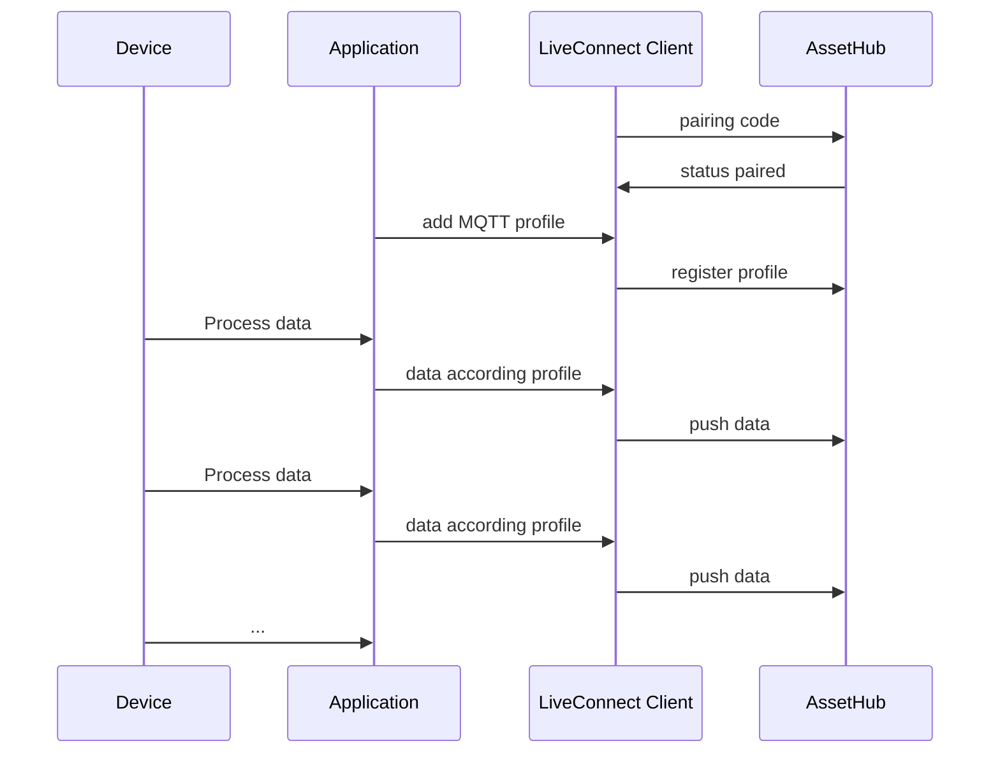
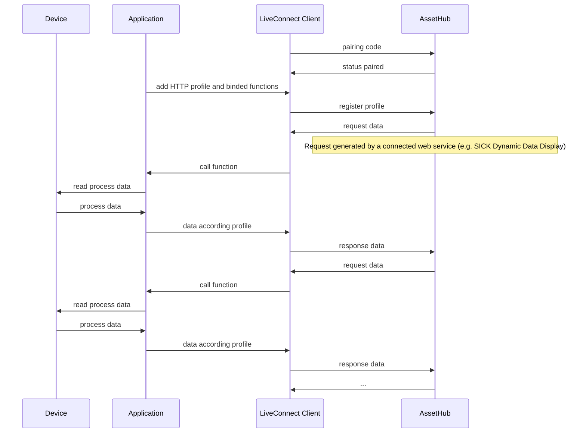

# CSK_Module_LiveConnect
This module provides the possibility to communicate data to a digital device (digital twin) configured in the SICK AssetHub.

## Pairing
Before data can be exchanged, the physical gateway device must first be paired with the digital twin in the SICK AssetHub.

After the pairing process, profiles can be made known to the Gateway device itself, or an attached devices (peerDevice).

## Profiles
The data that is exchanged between the device and the AssetHub is defined via profiles. It is possible to bind one or more profiles to a device.
There are two types of profiles that can be used:

### MQTT profiles
- Use-Case: The device automatically push data into the cloud.
- Profile-Type: [AsyncAPI]
- Profile-Editor: [AsyncAPI Studio]

#### Sequence (sample)

### HTTP profiles
- Use-Case: An HTTP request sent from the cloud side is transmitted to the device. The device generates a response that corresponds to the data profile and sends it back to the cloud (data poll mechanism).
- Profile-Type: [OpenAPI]
- Profile-Editor: [Swagger Editor]

#### Sequence (sample)

## How to Run
Please checkout the project and run the Powershell script "createProject.ps1". The script creates a project folder that can be opened with AppStudio. New versions of the dependent modules can also be loaded into the project via the script.

### Crown documention
A crown documentation of the app can be found [here](./docu/CSK_Module_LiveConnect.html)

## Information
### Tested on
|Device|Firmware|
|--|--|
|SIM1012|V2.3.0|
|SIM1000fx|V1.7.2|
|TDCE-E|L4M 2023.2 (with app Engine V2.0.0)|

### Dependencies
Following CSK modules are used for this application via Git subtrees and should NOT be further developed within this repository (see [contribution guideline](https://github.com/SICKAppSpaceCodingStarterKit/.github/blob/main/Contribution_Guideline.md) of this GitHub organization):  

|Module|Version|Remark
|--|--|--|
|CSK_1stModule_Logger|[V4.0.0](https://github.com/SICKAppSpaceCodingStarterKit/CSK_1stModule_Logger/releases/tag/v4.0.0)|Optional
|CSK_Module_DateTime|[V3.0.0](https://github.com/SICKAppSpaceCodingStarterKit/CSK_Module_DateTime/releases/tag/v3.0.0)|This module is not required using a TDC-E as gateway device
|CSK_Module_DeviceNetworkConfig|[V2.0.0](https://github.com/SICKAppSpaceCodingStarterKit/CSK_Module_DeviceNetworkConfig/releases/tag/v2.0.0)|This module is not required using a TDC-E as gateway device
|CSK_Module_PersistentData|[V4.0.0](https://github.com/SICKAppSpaceCodingStarterKit/CSK_Module_PersistentData/releases/tag/v4.0.0)|Necessary to persist data

>**Please note**
This application / module is part of the SICK AppSpace Coding Starter Kit developing approach.  
It is programmed in an object oriented way. Some of the modules use kind of "classes" in Lua to make it possible to reuse code / classes in other projects.  
In general it is not neccessary to code this way, but the architecture of this app can serve as a sample to be used especially for bigger projects and to make it easier to share code.  
Please check the [documentation](https://github.com/SICKAppSpaceCodingStarterKit/.github/blob/main/docu/SICKAppSpaceCodingStarterKit_Documentation.md) of CSK for further information.

## Tests
The project includes a test script that tests some aspects of the app.

This unit test establishes a paring between the device and the digital twin in the AssetHub. The corresponding asset must already exist in the AssetHub. The pairing token is given as the parameter "token" when the test is started. A peer device is automatically added to the gateway device. An HTTP and an MQTT profile are added to both devices (gateway and peer device). After the unit test has been successfully completed, the functionality must be checked using the checklist.

The unit tests can be started via an HTTP REST call (POST) or with a standard crown call.

    Body:
    {
      "data": {
        "token": "" // Empty string = Use an already existing pairing
      }
    }

>**Remark**
The test classes are executed in alphabetical order. The test cases do not really have a "unit test" character, but are a mixture of unit tests and integration tests.

## Topics
Coding Starter Kit, CSK, Module, SICK-AppSpace, LiveConnect, AssetHub, Cloud

[AsyncAPI]: <https://www.asyncapi.com>
[AsyncAPI Studio]: <https://studio.asyncapi.com>
[OpenAPI]: <https://www.openapis.org>
[Swagger Editor]: <https://editor.swagger.io>