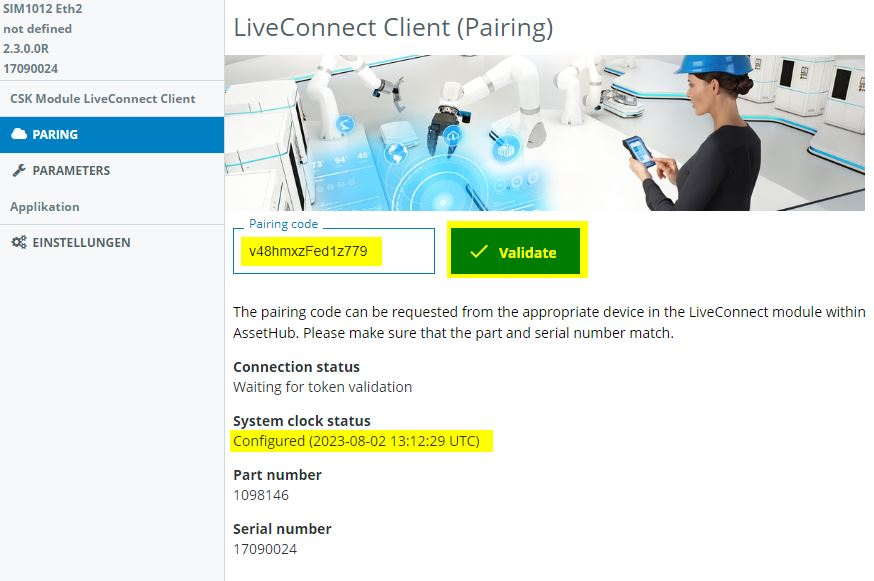
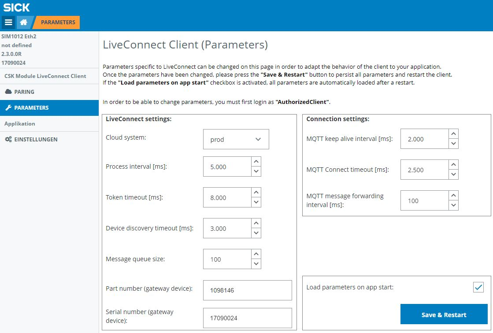

# CSK_Module_LiveConnect

This module provides features to communicate data to a digital device (digital twin) configured in the SICK AssetHub.  
### Info: Regarding further information on how to use this module please have a look into the [CSK_Template_AssetHub](https://github.com/SICKAppSpaceCodingStarterKit/CSK_Template_AssetHub).  

## How to Run
The app includes an intuitive GUI to setup the LiveConnect Client pairing.  
For further information check out the [documentation](https://raw.githack.com/SICKAppSpaceCodingStarterKit/CSK_Module_LiveConnect/main/docu/CSK_Module_LiveConnect.html) in the folder "docu" and the [CSK_Template_AssetHub](https://github.com/SICKAppSpaceCodingStarterKit/CSK_Template_AssetHub).

## Parameters
Some specific parameters can be changed in order to adapt the behavior of the client to your application.  
Once the parameters have been changed, please press the **"Save & Restart"** button to persist all parameters and restart the client.  If the **"Load parameters on app start"** checkbox is activated, all parameters are automatically loaded after a restart.

>**Remark**
> Usually no changes need to be made here

### LiveConnect settings
General LiveConnect settings. 

| Parameter name | Description  |
|--|--|
| Cloud system | Selection of the cloud system to be used (prod,int,dev). **For SICK internal use only**|
| Process interval [ms] | Process interval to notice status changes of the LiveConnect connection |
| Token timeout [ms] | Timeout for the accepting of the pairing token. You can adjust this parameter if you have a slow internet connection. |
| Device discovery timeout [ms] | Device discovery timeout to sync the configured devices with the AssetHub. |
| Message queue size | If the LiveConnect connection is broken, the produced data from the edge side is stored in a queue. This data is retransmitted as soon as a connection to the cloud is established. If the queue is full, the oldest data is discarded.|
| Part number (gateway device) | Part number of the gateway device. If it cannot determined automatically, you can specify it here. |
| Serial number (gateway device) | Serial number of the gateway device. If it cannot determined automatically, you can specify it here. |

### Connection settings
If your application has an slow internet connection, the following parameters may need to be adjusted.

| Parameter name | Description  |
|--|--|
| MQTT keep alive interval [ms] | Keep alive interval of the MQTT client. |
| MQTT Connect timeout [ms] | Connect timeout of the MQTT client. |
| MQTT message forwarding interval [ms] | Specifies the minimum interval at which data should be updated on the cloud side. |

## Dependencies
Following CSK modules are mostly necessary to make use of the features of this module:  

|Module|Version|Remark
|--|--|--|
|CSK_1stModule_Logger|[V4.0.0](https://github.com/SICKAppSpaceCodingStarterKit/CSK_1stModule_Logger/releases/tag/v4.0.0)|Optional
|CSK_Module_DateTime|[V3.0.0](https://github.com/SICKAppSpaceCodingStarterKit/CSK_Module_DateTime/releases/tag/v3.0.0)|This module is not required using a TDC-E as gateway device
|CSK_Module_DeviceNetworkConfig|[V2.0.0](https://github.com/SICKAppSpaceCodingStarterKit/CSK_Module_DeviceNetworkConfig/releases/tag/v2.0.0)|This module is not required using a TDC-E as gateway device
|CSK_Module_PersistentData|[V4.0.0](https://github.com/SICKAppSpaceCodingStarterKit/CSK_Module_PersistentData/releases/tag/v4.0.0)|Necessary to persist data

## Information
### Tested on
|Device|Firmware|
|--|--|
|SIM1012|V2.3.0|
|SIM1000fx|V1.7.2|
|TDCE-E|L4M 2023.2 (with app Engine V2.0.0)|

> This application / module is part of the SICK AppSpace Coding Starter Kit developing approach.  
It is programmed in an object oriented way. Some of the modules use kind of "classes" in Lua to make it possible to reuse code / classes in other projects.  
In general it is not neccessary to code this way, but the architecture of this app can serve as a sample to be used especially for bigger projects and to make it easier to share code.  
Please check the [documentation](https://github.com/SICKAppSpaceCodingStarterKit/.github/blob/main/docu/SICKAppSpaceCodingStarterKit_Documentation.md) of CSK for further information.

## Topics
Coding Starter Kit, CSK, Module, SICK-AppSpace, LiveConnect, AssetHub, Cloud
