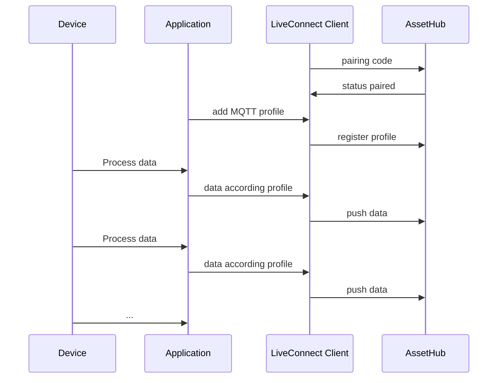
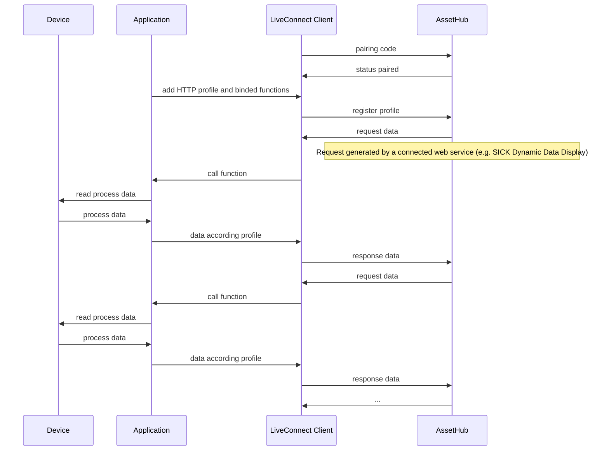

# CSK_Module_LiveConnect
This module provides the possibility to communicate data to a digital device (digital twin) configured in the SICK AssetHub.

## Pairing
Before data can be exchanged, the physical gateway device must first be paired with the digital twin in the SICK AssetHub.

After the pairing process, profiles can be made known to the Gateway device itself, or an attached devices (peerDevice).

## Profiles
The data that is exchanged between the device and the AssetHub is defined via profiles. It is possible to bind one or more profiles to a device.
There are two types of profiles that can be used:

### MQTT profiles
- Use-Case: The device automatically push data into the cloud.
- Profile-Type: [AsyncAPI]
- Profile-Editor: [AsyncAPI Studio]

#### Sequence (sample)

### HTTP profiles
- Use-Case: An HTTP request sent from the cloud side is transmitted to the device. The device generates a response that corresponds to the data profile and sends it back to the cloud (data poll mechanism).
- Profile-Type: [OpenAPI]
- Profile-Editor: [Swagger Editor]

#### Sequence (sample)

## How to Run

[***...please fill with informations...***]  
For further information check out the [documentation](https://raw.githack.com/SICKAppSpaceCodingStarterKit/[REPO_OF_MODULE]/main/docu/CSK_Module_[MODULENAME].html) [update link] in the folder "docu".

## Information

Tested on:
[Device] - [firmware]
...

[***optionally***]
Following CSK modules are used for this application via Git subtrees and should NOT be further developed within this repository (see [contribution guideline](https://github.com/SICKAppSpaceCodingStarterKit/.github/blob/main/Contribution_Guideline.md) of this GitHub organization):  

  * CSK_Module_XYZ (release/tag v1.2.3)

This application / module is part of the SICK AppSpace Coding Starter Kit developing approach.  
It is programmed in an object oriented way. Some of the modules use kind of "classes" in Lua to make it possible to reuse code / classes in other projects.  
In general it is not neccessary to code this way, but the architecture of this app can serve as a sample to be used especially for bigger projects and to make it easier to share code.  
Please check the [documentation](https://github.com/SICKAppSpaceCodingStarterKit/.github/blob/main/docu/SICKAppSpaceCodingStarterKit_Documentation.md) of CSK for further information.  

## Topics

Coding Starter Kit, CSK, Module, SICK-AppSpace, LiveConnect, AssetHub, Cloud

[AsyncAPI]: <https://www.asyncapi.com>
[AsyncAPI Studio]: <https://studio.asyncapi.com>
[OpenAPI]: <https://www.openapis.org>
[Swagger Editor]: <https://editor.swagger.io>