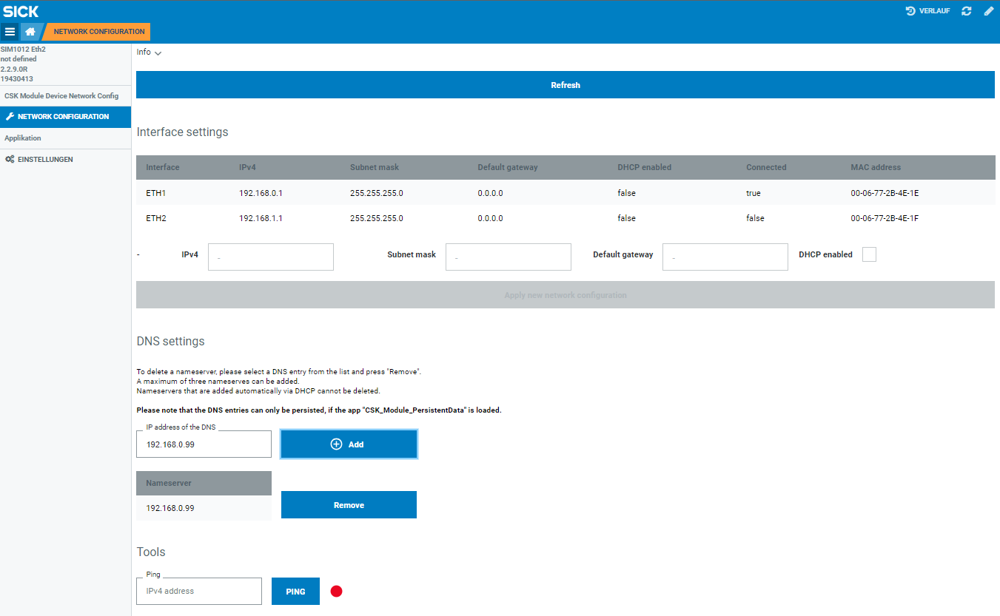

# CSK_Module_DeviceNetworkConfig

Module to provide ethernet setup functionality.

## How to Run
The app includes an intuitive GUI to setup the ethernet setup of the device.  
For further information check out the [documentation](https://raw.githack.com/SICKAppSpaceCodingStarterKit/CSK_Module_DeviceNetworkConfig/main/docu/CSK_Module_DeviceNetworkConfig.html) in the folder "docu".

## Information

Tested on:  
1. SIM1012        - Firmware 2.3.0
2. SIM1000fx      - Firmware 1.7.2

>**Please note**
> This application / module is part of the SICK AppSpace Coding Starter Kit developing approach.  
It is programmed in an object oriented way. Some of the modules use kind of "classes" in Lua to make it possible to reuse code / classes in other projects.  
In general it is not neccessary to code this way, but the architecture of this app can serve as a sample to be used especially for bigger projects and to make it easier to share code.  
Please check the [documentation](https://github.com/SICKAppSpaceCodingStarterKit/.github/blob/main/docu/SICKAppSpaceCodingStarterKit_Documentation.md) of CSK for further information.

### Dependencies

|Module|Version|Remark
|--|--|--|
|CSK_Module_PersistentData|[V4.0.0](https://github.com/SICKAppSpaceCodingStarterKit/CSK_Module_PersistentData/releases/tag/v4.0.0)|Necessary to persist the DNS settings 

## Topics
Coding Starter Kit, CSK, Module, SICK-AppSpace, Ethernet, Interface, Config, Device, DNS, DHCP, IP, PING
